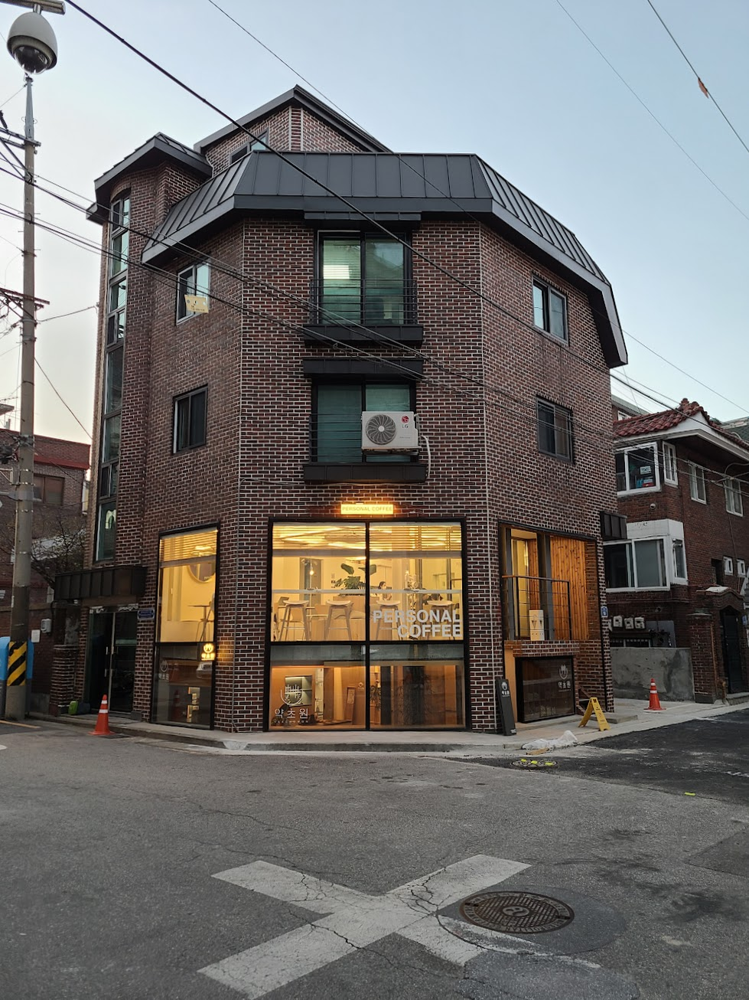

## 문제 1

Q: 다음 이미지에 대한 설명 중 옳지 않은 것은 무엇인가요?
- (1) 이미지는 현대적인 실내 공간을 보여줍니다.
- (2) 중앙에 커다란 디지털 화면이 설치되어 있습니다.
- (3) 의자들이 바 형태의 테이블 주변에 놓여 있습니다.
- (4) 화면에는 사람들의 얼굴이 크게 보입니다.

Listening: Which of the following descriptions of the image is incorrect?
- (1) The image shows a modern indoor space.
- (2) There is a large digital screen installed in the center.
- (3) Chairs are placed around a bar-style table.
- (4) The screen prominently displays people's faces.

정답: (4) 화면에는 사람들의 얼굴 대신 추상적인 이미지가 보입니다.

-------------------------------

## 문제 2

Q: 다음 이미지에 대한 설명 중 옳지 않은 것은 무엇인가요?
- (1) 많은 사람들이 테이블에 앉아 컴퓨터 작업을 하고 있습니다.
- (2) 벽에는 다양한 색상의 배너가 걸려 있습니다.
- (3) 사람들은 소파에 앉아 쉬고 있습니다.
- (4) 행사장은 실내에 있는 것으로 보입니다.

Listening: Which of the following descriptions of the image is incorrect?
- (1) Many people are sitting at tables working on computers.
- (2) There are banners in various colors hanging on the wall.
- (3) People are sitting on sofas relaxing.
- (4) The event seems to be indoors.

정답 : (3) 사람들은 소파에 앉아 있지 않고 의자에 앉아 있습니다.

-------------------------------

## 문제 3

Q: 다음 이미지에 대한 설명 중 옳지 않은 것은 무엇인가요?
- (1) 이미지에는 노란색 조각이 있습니다.
- (2) 건물 위쪽에는 ‘Local Stitch’라는 글자가 보입니다.
- (3) 붉은 벽돌로 지어진 건물이 있습니다.
- (4) 이미지에는 여러 사람이 모여 있는 모습이 보입니다.

Listening: Which of the following descriptions of the image is incorrect?
- (1) There is a yellow sculpture in the image.
- (2) The words 'Local Stitch' are visible at the top of the building.
- (3) There is a building made of red bricks.
- (4) The image shows several people gathered together.

정답: (4) 이미지에는 여러 사람이 모여 있는 모습이 보이지 않습니다.

-------------------------------

## 문제 4

Q: 다음 이미지에 대한 설명 중 옳지 않은 것은 무엇인가요?
- (1) 사람들이 카페에서 음료를 주문하고 있습니다.
- (2) 카운터 뒤에 노란색 벽이 보입니다.
- (3) 테이블에 사람들이 앉아 있습니다.
- (4) 큰 창문이 카페에 자연광을 들여옵니다.

Listening: Which of the following descriptions of the image is incorrect?
- (1) People are ordering drinks at the cafe.
- (2) There is a yellow wall behind the counter.
- (3) There are people sitting at the table.
- (4) Large windows bring natural light into the cafe.

정답: (3) 테이블에 사람들이 앉아 있지 않습니다.

-------------------------------

## 문제 5

Q: 다음 이미지에 대한 설명 중 옳지 않은 것은 무엇인가요?

- (1) 이 건물은 벽돌로 지어져 있습니다.
- (2) 1층 창문에 "PERSONAL COFFEE"라는 문구가 보입니다.
- (3) 건물은 3층으로 구성되어 있습니다.
- (4) 건물 앞 도로에 파란색 원뿔이 있습니다.

Listening: Which of the following descriptions of the image is incorrect?

- (1) The building is made of brick.
- (2) The first-floor window displays the phrase "PERSONAL COFFEE."
- (3) The building consists of three floors.
- (4) There is a blue cone on the road in front of the building.

정답: (4) 건물 앞 도로에는 주황색 원뿔이 있습니다.

-------------------------------

## 문제 6

Q: 다음 이미지에 대한 설명 중 옳지 않은 것은 무엇인가요?
- (1) 다양한 종류의 빵이 진열되어 있습니다.
- (2) 점원이 빨간색 모자를 쓰고 있습니다.
- (3) 빵 위에 가격표가 붙어 있습니다.
- (4) 진열대가 유리로 되어 있습니다.

Listening: Which of the following descriptions of the image is incorrect?
- (1) Various types of bread are displayed.
- (2) The clerk is wearing a red cap.
- (3) There are price tags on the bread.
- (4) The display is made of glass.

정답: (2) 점원은 빨간색 모자가 아닌 흰색 모자를 쓰고 있습니다.

-------------------------------

## 문제 7

Q: 다음 이미지에 대한 설명 중 옳지 않은 것은 무엇인가요?
- (1) 수박이 1만원 할인된 가격으로 판매됩니다.
- (2) 한우 등심은 최대 60% 할인됩니다.
- (3) 아이스크림 25종은 500원에 판매됩니다.
- (4) 돼지고기 삼겹살/목심이 62% 할인됩니다.

Listening: Which of the following descriptions of the image is incorrect?
- (1) Watermelons are sold at a 10,000 won discount.
- (2) Korean beef sirloin is up to 60% off.
- (3) 25 types of ice cream are sold at 500 won.
- (4) Pork belly/neck is 62% off.

정답: (2) 한우 등심은 최대 50% 할인됩니다.

-------------------------------

## 문제 8

Q: 다음 이미지에 대한 설명 중 옳지 않은 것은 무엇인가요?
- (1) 사람들이 건물 앞에서 작업을 하고 있습니다.
- (2) 포메 베르트라는 베이커리 카페의 간판이 보입니다.
- (3) 사람들이 공원을 산책하는 모습이 보입니다.
- (4) 작업자 중 한 명이 모자를 쓰고 있습니다.

Listening: Which of the following descriptions of the image is incorrect?
- (1) People are working in front of a building.
- (2) There is a sign for a bakery cafe called "Pomme Verte."
- (3) People are seen walking in a park.
- (4) One of the workers is wearing a hat.

정답: (3) 사람들이 공원을 산책하는 모습은 보이지 않습니다.

-------------------------------

## 문제 9

Q: 다음 이미지에 대한 설명 중 옳지 않은 것은 무엇인가요?
- (1) 많은 사람들이 카페에서 자리를 잡고 있습니다.
- (2) 바닥은 나무로 되어 있습니다.
- (3) 천장에 조명이 여러 개 설치되어 있습니다.
- (4) 창문 밖에는 눈이 내리고 있습니다.

Listening: Which of the following descriptions of the image is incorrect?
- (1) Many people are seated at the cafe.
- (2) The floor is made of wood.
- (3) There are multiple lights installed on the ceiling.
- (4) It is snowing outside the windows.

정답: (4) 창문 밖에는 눈이 내리고 있지 않습니다.

-------------------------------

## 문제 10

Q: 다음 이미지에 대한 설명 중 옳지 않은 것은 무엇인가요?
- (1) 사람들이 관광버스를 타기 위해 줄을 서 있습니다.
- (2) 창문에 'COFFEE & BAKERY'라는 글자가 보입니다.
- (3) 도로변에 큰 빌딩들이 줄지어 서 있습니다.
- (4) 모든 사람들이 스마트폰을 보고 있습니다.

Listening: Which of the following descriptions of the image is incorrect?
- (1) People are lining up to board a tour bus.
- (2) The window shows the words 'COFFEE & BAKERY.'
- (3) There are large buildings lined up along the roadside.
- (4) Everyone is looking at their smartphones.

정답: (4) 모든 사람들이 스마트폰을 보고 있는 것은 아닙니다.

-------------------------------

## 문제 11

Q: 다음 이미지에 대한 설명 중 옳지 않은 것은 무엇인가요?
- (1) 카페에서 사람들이 앉아 있는 모습이 보입니다.
- (2) 두 사람이 테이블에 앉아 있습니다.
- (3) 모든 테이블이 사람들로 가득 차 있습니다.
- (4) 바닥이 반짝거리는 모습입니다.

Listening: Which of the following descriptions of the image is incorrect?
- (1) It shows people sitting in a cafe.
- (2) Two people are seated at a table.
- (3) All tables are full of people.
- (4) The floor is shiny.

정답: (3) 모든 테이블이 사람들로 가득 차 있지는 않습니다.

-------------------------------

